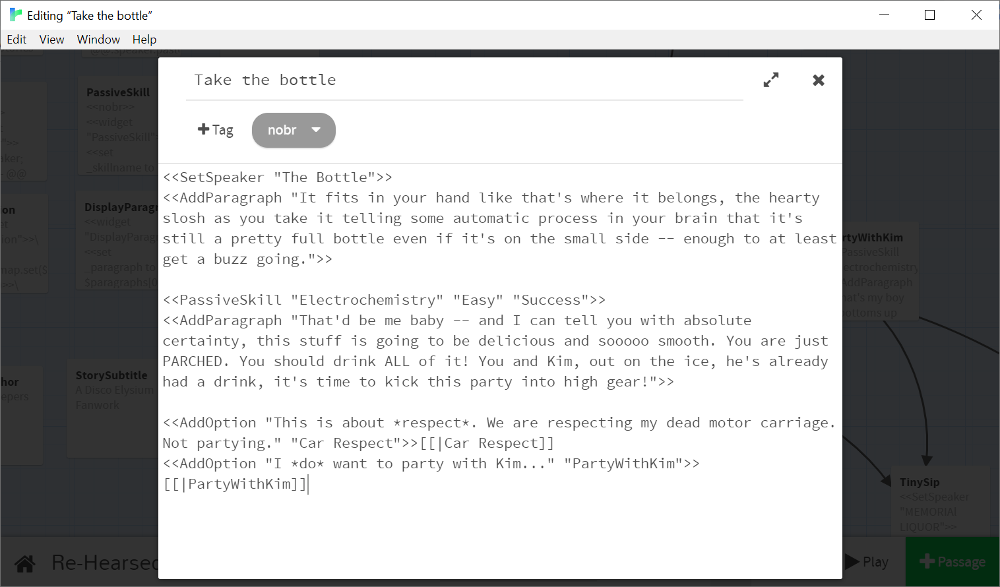

# Disco Elysium Twine Macros Source
This is a copy of "Re-Hearsed", a fanwork I created for Disco Elysium in Twine using Sugarcube 2.30.0 and a set of custom macros. The intent is that you can use this story as a jumping point for your own project, with the same macros.

A short set of instructions follow on how to use the macros. The game itself can be played on itch at: https://apepers.itch.io/re-hearsed-a-disco-elysium-fanwork

At its core, this is simply a set of macros that provide a styling that is evocative of Disco Elysium. The macros themselves are agnostic and simply give you easy formatting and colour - you can use this styling to create any kind of Twine game you choose, not just a fangame.

Thank you to ZA/UM for creating Disco Elysium, a game I enjoyed so much, and to the Disco(rd) Elysium community for their support and encouragement! Special thanks as well to my dear Kawa who provided invaluable feature requests and is responsible for this repo being as user-friendly as it is.

# Setting up your own Disco Elysium Twine Fangame - two options
You will need a recent version of Twine (this was created using 2.3.5). Regardless of which of the options you pick below, you'll also need SkillSuccess.png and SkillFailure.png for the overlays, saved wherever your game lives. 

## No Twee Required - BlankProject.html
You can then download BlankProject.html from the 'BlankProject' folder of this repo and import it as a new story into Twine. This is great if you just want to mess around with the macros in the visual editor without using more programmatic tools!

## A step up - BlankProject.twee

(Based on the work of Em LazerWalker: https://blog.lazerwalker.com/azure,/game/dev/2020/01/16/a-modern-developers-workflow-for-twine.html)

To take advantage of working in a text editor, easier collaboration, and other more program-focused features, as well as to get Github Pages to host your game, what you'll want is 'BlankProject.twee' in the BlankProject folder, Tweego, and you favourite text editor. I recommend VS Code because it has a Twee syntax highlighter! (See [this Tweego Instructions Readme for more information on using Tweego and Github Pages.](TweegoInstructions.md))

# Using the macros
Once your project is set up, most of the functionality around continue buttons, displaying previously chosen options, and formatting passive skill checks is handled for you - as long as you use the provided macros. There is a small set that provides the full functionality of this game.

## SetSpeaker and AddParagraph
These two macros make up the bulk of the writing. ```SetSpeaker``` is used to set up who or what the dialogue will belong to, such as ```"Kim Kitsuragi"``` or ```"Sunken Motor Carriage"```. 

This will overwrite whoever the currently set speaker is - you should always make sure to use at the start of a new passage to ensure it's set up correctly no matter where you're coming from.

So an example beginning of a passage would be:
```
<<SetSpeaker "Alexei Pepers">>
<<AddParagraph "\"I hope you have an easy time using this plugin!\" she says, cheerfully.">>
```

Note that as the text inside of macros is specified with double-quotes, you will need to escape any double-quotes you wish to appear in the text itself when a character is speaking, ```\"Like so \"```

Also note that if you want to break up multiple paragraphs with the same speaker, it's unnecessary to set the speaker each time - it will stay whatever it was last set to. 

### BlankSpeaker

If you'd like to override the repeated speaker behaviour, use ```BlankSpeaker```, like so:

```
<<BlankSpeaker>>
<<AddParagraph "This is a paragraph without any speaker, for effect.">>
```

(Credit to Alphawave for the original idea for this feature - and check out her game using the framework, "Requiem for the Apostle"! https://alphawave.itch.io/requiem-for-the-apostle)

## PassiveSkill
The other macro used for dialogue is the ```PassiveSkill``` macro, which represents skill checks appearing inside of dialogue. It's basically a special kind of SetSpeaker macro that sets your speaker to be a particular skill. You follow it up with your usual ```AddParagraph``` macro containing the actual text of the skill check. You can reference any of the defined Disco Elysium skills and it will use an appropriate colour for the text. You can add your own skills too - see later in this guide!

There are two ways to include a passive skill:
```
<<PassiveSkill "Logic">>
<<AddParagraph "Like this, as a free aside.">>

<<PassiveSkill "Logic" "Easy" "Success">>
<<AddParagraph "Or like this, as a check with a difficulty, and success or failure.">>
<<PassiveSkill "Volition" "Legendary" "Failure">>
<<AddParagraph "Currently you as the writer specify success or failure - real dice rolls may be incoming, but not at the moment.">>
```

Remember that the ```PassiveSkill``` is setting the current speaker, so if after a skill check you return to a previously speaking character, you will need to use ```SetSpeaker```again.

Note that while you have to spell the skill names correctly, capitalization does not matter - the macros will render them in all caps for you.

## Green Text: Items, Tasks, Thoughts, Levels
Besides dialogue, a common feature in Disco Elysium are "green text" passages - gaining and losing items, gained Thoughts, new and completed Tasks, and leveling up. While there isn't support for the full UI, we can at least replicate these features in text. The syntax for them is pretty straight forward:

```
<<ItemGained "Blue oblong pen">>
<<ItemLost "Your dignity">>
<<NewTask "Make it up to Kim">>
<<ThoughtGained "Stereo-partnership">>
<<TaskComplete "Get Kim alone" 5>>
<<SecretTaskComplete "Allow multiple tasks completed at once" 15>>
<<LevelUp>>
```

The numbers after ```TaskComplete``` and ```SecretTaskComplete``` indicate how much XP you want displayed as gained.

## AddOption
Another macro is how we give the player options. The ```AddOption``` macro takes in the text to be displayed for the option, and the name of the passage that it should link to, like so:
```
<<AddOption "Move to the next part of the tutorial" "NextTutorialPassage">>
<<AddOption "\"Remember, you need to escape double-quotes if this is spoken word!\"" "FriendlyReminderPassage">>
```

However many options you add, they will all be listed at the bottom of the page without any further calls on your part.
The downside of using macros for this is that you will not automatically get a visual link between passages in Twine. For my own convenience, what I do is always create a matching empty link to the correct passage immediately after the option, like so:
```
<<AddOption "It's annoying, but it works!" "SorryDevPassage">>[[|SorryDevPassage]]
```

Now you'll see the link in Twine, but because the text is empty it will not mess with any clicking.

## SkillSuccess and SkillFailure
You may want to replicate the experience of making a skill check, by manually writing an ```AddOption``` that looks like a skill check:
```
<<AddOption "[Logic - Medium 10] Can I make an option that looks like the game?" LogicCheck>>[[|LogicCheck]]
<<AddOption "[Interfacing - Impossible 20] Can I make the Twine do dice rolls?" InterfacingCheck>>[[|InterfacingCheck]]
```

At the start of the passage it leads to, you can add ```SkillSuccess``` to replicate the experience of succeeding at a check, with a little overlay and a green screen flash.

```
:: LogicCheck
<<SkillSuccess>>

<<SetSpeaker "Kawa">>
<<AddParagraph "Hey, you did it!">>
```

```SkillFailure``` does a similar thing for failing at a check, with a different overlay and a red screen flash. Right now, we don't have any way to replicate the actual dice rolls/RNG, but other people are working on it!

```
:: InterfacingCheck
<<SkillFailure>> 

<<SetSpeaker "Kawa">>
<<AddParagraph "Sorry, this functionality's not here yet!">>
```

## Whitespace
Because this format is attempting to replicate such a specific visual style, the macros are responsible for setting up the specific layout and whitespace of the text. This means that our passage itself is just a series of macro calls, and any whitespace inside of it should be ignored. 

You can do this a few ways, but the easiest is that for any passage of your story, add the tag **"nobr"**. You can then use as many newlines as required to make the passage legible, without impacting the formatting of the final story.

Here's an example passage bringing it all together, and note the "nobr" tag at the top:


(If you know a better way to handle this, feel free to Tweet at me or submit a pull request, I've only used Twine once before so my solutions work but are I'm sure not ideal!)

## Tips and Tricks
This repo includes some more in-depth advice put together by Kawa regarding writing Twine games in the canon Disco Elysium style. You can find [tips on how to write in the Disco Elysium style here](WritingTips.md) and you can find [tips on how to have fun with twine here](TwineTips.md)!
As some parting notes:
* This is still running as Sugarcube, and there is nothing stopping you from using variables or any other default Twine features, even though I used them lightly in my own game. This also means that you should use Sugarcube syntax for ```//italics//``` and ```''bold''```. (Though it's worth noting that the game itself pretty much never actually italicizes or bolds within the text, choosing instead to use ALL CAPS and ```*asterisks*```, which helpfully will always render correctly when written as is.) You may get into trouble if you try to output text in a way that doesn't mesh with the current macros, but any kind of conditions or logic do in fact work as normal. Refer to the SugarCube documentation for more information: http://www.motoslave.net/sugarcube/2/docs/ 
* The page is scrolling to handle mobile support, so nothing is stopping you from adding as many paragraphs to a given passage as you want - however, any time you want a player response, it will have to link to a new passage barring some extra work on your part.
* In my experience writing this, the most common failure points are un-escaped double-quotes and missed 'nobr' tags. Both will be immediately evident when you view the game, so test often and if you see something funky with your spacing or missing text, check your escaped characters and your whitespace.

## Adding your own skills and attributes
Inside of the StoryInit passage there are arrays of strings defining the skills associated with each attribute in Disco Elysium. The PassiveSkill macro then looks for a match between the skill name it's given and each array, and then adds a CSS class to the speaker based on which attribute it matches. 
So if you want to modify or add skills and still use the same attributes, simply change the arrays in StoryInit. You can now specify your custom skills in PassiveSkill macros and will see the correct text colour.
If you want to also add a new attribute, there are a few more steps:
1. Open up the Story Stylesheet and find the existing attribute definitions and add a new definition with your new attribute name and the new colour. 
2. Add a new array of the skill names for your new attribute inside of StoryInit. 
3. Inside of the PassiveSkill macro, add another set of logic checking for your new attribute just like how the current attributes work, and apply your new tag you set up in the CSS.

I hope some people enjoy this, if you make something fun please share it!
