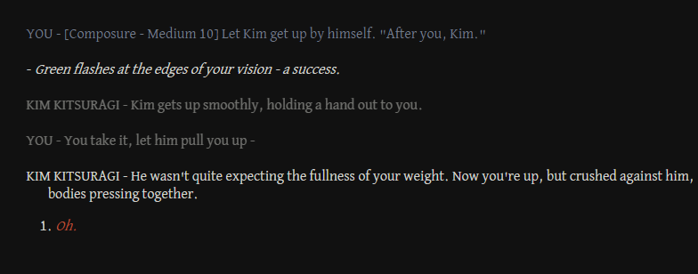
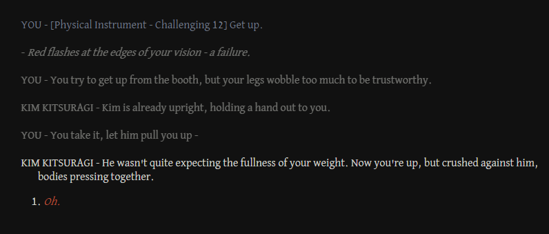
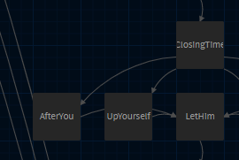

# Fun With Twine

(These notes are by Kawa, on things to keep in mind when making games/stories using the Disco Elysium macros. See WritingTips.md for information about the Disco Elysium writing style - these are more "programmatic", getting Twine to do what you want.)

# Formatting

The Disco Elysium macros are based on Twine Story Format called "SugarCube". It overwrites the default "Link" behavior for AddOption, but otherwise follows SugarCube style settings.

The major things you'll need here are Emphasis, usually rendered as italics, which requires `//two slashes on each side//`; and Strong, usually rendered as bold, which requires `''two single quotes - NOT DOUBLE QUOTES!''`

Also worth noting is that with how `AddParagraph` works, you need to "escape" quotation marks in order for them to show up within your paragraphs. You do so with backslashes: `<<AddParagraph "He looks at you sadly. \"Please be okay.\"">>` Don't forget to include the quotation mark to end your paragraph, even when writing dialogue! Many modern programming-focused text editors will add extra quotation marks for you, but it's worth checking everything "closes out" on your own, too. 

# Shared text - `<<include>>`

You could have two or more options that lead to passages that start differently, but end the same.

```
<<AddOption "\[Composure - Medium 10\] Let Kim get up by himself. \"After you, Kim.\"" "AfterYou">>[[|AfterYou]]
<<AddOption "\[Physical Instrument - Challenging 12\] Get up." "UpYourself">>[[|UpYourself]]

:: AfterYou [nobr] 
<<SkillSuccess>>

<<SetSpeaker "KIM KITSURAGI">>
<<AddParagraph "Kim gets up smoothly, holding a hand out to you.">>

<<include LetHim>>[[|LetHim]]

:: UpYourself [nobr] 
<<SkillFailure>>

<<SetSpeaker "YOU">>
<<AddParagraph "You try to get up from the booth, but your legs wobble too much to be trustworthy.">>

<<SetSpeaker "KIM KITSURAGI">>
<<AddParagraph "Kim is already upright, holding a hand out to you. ">>

<<include LetHim>>[[|LetHim]]
```

I want both of these to continue with a passage (where Kim pulls you up.) The `<<include LetHim>> [[|LetHim]]` piece at the end of each of these looks for a passage called `LetHim` and tacks it on the end:

```
:: LetHim [nobr]

<<SetSpeaker "YOU">>
<<AddParagraph "You take it, let him pull you up - ">>

<<SetSpeaker "KIM KITSURAGI">>
<<AddParagraph "He wasn't quite expecting the fullness of your weight. Now you're up, but crushed against him, bodies pressing together.">>

<<AddOption "//Oh.//" "AssGrab">>[[|AssGrab]]
```

This means you'll get these two paragraphs and option at the end of both of those options! 





It's nice because then if you want to edit this text, you only have to edit it once, inside `LetHim`, instead of remembering to change it in both `AfterYou` and `UpYourself`.

# Comments

You may want to include notes to yourself as a writer that won't actually be rendered.

This can be done by starting and ending a line 

`/* like this, with the slash and asterisk "bracketing" the line. */`

You can even do this at the end of a line that'll render:

```
<<AddOption "Help!" HelpMe>>[[|HelpMe]] /* Leads to the 'plead for help' branch */
```

Or comment out blocks of code:

```
/* I don't want this option to render until I'm done writing it. */
/* <<AddOption "Unfinished option">> */
```

And if you use the "Tweego" option for making your game, you can even have these comments between or at the start of passages! 

# Variables

There are two kinds of variables, "global" and "local". "Global" variables carry their definitions across passages, and "local" ones do not.

Use the `set` function to create a variable or change its value:

`<<set $feeling to "happy">>`

It's good practice to set all your global variables to a default value in the `StoryInit` passage!

You can also create true/false and number variables:

```
<<set $xp to 10>>
<<set $feelsGood to true>>
```

## A note about variable setting in options

Because the macros overwrite the usual Link behavior, the way Sugarcube documentation asks you to set variables in passage transition **does not work** as written. Instead, you'll need a workaround, using `<<include>>` and global variables.

```
<<AddOption "\"There's a store on Boogie Street, sells really salacious things for men of the underground.\"" SB2_Boogie_m>>[[|SB2_Boogie_m]]
<<AddOption "\"There's a store on Boogie Street, sells //really// salacious things for men of the underground, with a good deal of discretion. Frilly, lacy things.\"" SB2_Boogie_f>>[[|SB2_Boogie_f]]

:: SB2_Boogie_m [nobr] {"position":"100,1600"}
<<set $lovely to "hot and exposed">>
<<include SB2_Boogie>>[[|SB2_Boogie]]

::SB2_Boogie_f [nobr] {"position":"300,1600"}
<<set $lovely to "pretty">>
<<include SB2_Boogie>>[[|SB2_Boogie]]
```

So whichever is picked, the variable `$lovely` changes, but all the text is in `SB2_Boogie`. 

# Conditionals

The most common type of conditional is the "if statement":

```
<<SetSpeaker "You">>
<<if $feeling is "happy">>
<<AddParagraph "\"I feel good about this!\"">>
<<elseif $feeling is "sad">>
<<AddParagraph "\"I don't feel so good...\"">>
<<else>>
<<AddParagraph "\"I'm not sure how I'm feeling.\"">>
<<endif>>
```

This will become `YOU - "I feel good about this!"` if `$feeling` was set to "happy", but say different things if it's set to other things. Note the use of `is` to compare strings. The `elseif` segment in the middle is only for if you have more than two options you're checking. And make sure there's no space in there, or between the angle brackets and the if/elseif/else/endif keywords!

A common trick I'll use is setting a global variable much earlier, then checking it to then set a local variable later - usually a description, dependent on what the characters have done earlier.

```
<<if $drink is "cocktail">>
<<set _drinkglass to "heavy rocks">>
<<else>>
<<set _drinkglass to "cheap wine">>
<<endif>>

<<PassiveSkill "Perception (Sight)" "Medium" "Success">>
<<AddParagraph "The lieutenant raises the _drinkglass glass to his lips.">>
```

This will say "The lieutenant raises the heavy rocks glass to his lips." if the cocktail was picked, and "The lieutenant raises the cheap wine glass to his lips." if it wasn't.

Note that you cannot use local variables inside `<<AddOption >>` text, due to how the macros handle options across passages - however, you can use one global variable to set another, and that *will* work!

```
<<if $apartment is "Harry">>
<<set $direction to "I'd get to take you home">>
<<else>>
<<set $direction to "you'd take me home">>
<<endif>>
<<AddOption "\"It's a bit of a shame, if I'd known $direction, I would have worn something nicer...\"" SB_Fashion>>
```

(This makes sure Harry gets it right between "I'd get to take you home" versus "you'd take me home".)

Other conditionals should work, `<<for>>` and `<<switch>>`, but I personally never used them. 

# More Resources

The general Twine guide: http://twinery.org/wiki/twine2:guide - It's good for info about Twine in general - where your file is saved, publishing, and general navigation. Your Story Format has already been chosen for you - it's SugarCube!

The SugarCube reference document: http://www.motoslave.net/sugarcube/2/docs/ - It's the right reference to use for formatting text (in "Markup" - things like //italics//, ''bold'', and so on) and logic that'll make your game more dynamic (in "Macros", things like if/then statements, and $global and _local variables!)